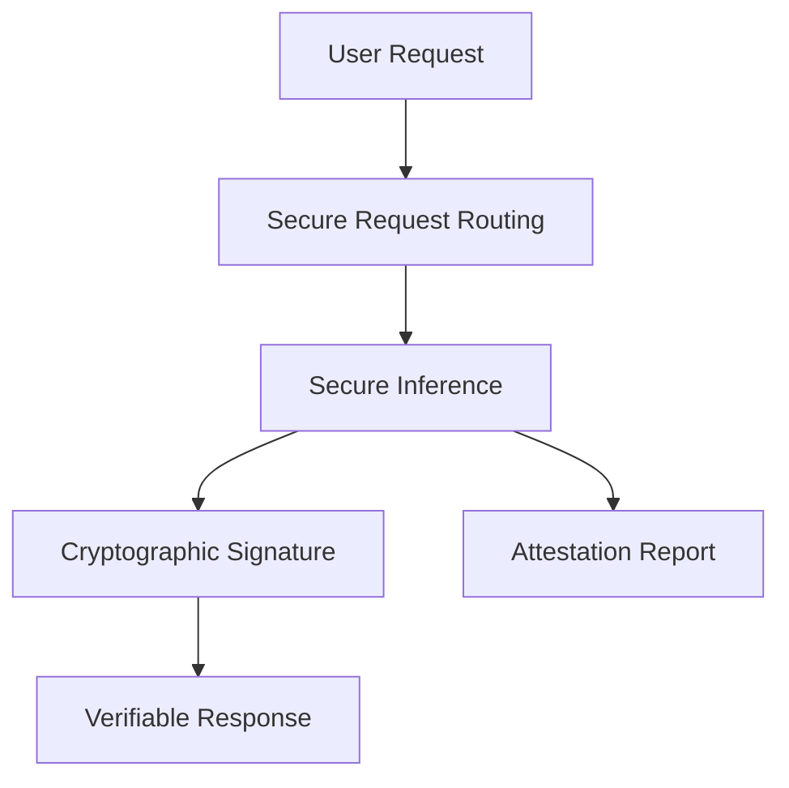

# Private Inference

NEAR AI Cloud's private inference capabilities leverage Trusted Execution Environments (TEEs) to provide cryptographically verifiable AI computations while ensuring complete data privacy. This guide explains how private inference works, its architecture, and security guarantees.

Private inference ensures that your AI model interactions are completely private and verifiable, with cryptographic proofs that guarantee the integrity of every computation.

---

## What is Private Inference?

Private inference in NEAR AI Cloud ensures that your AI model interactions are:

- **🔒 Private**: Your prompts, model weights, and outputs are never visible to the infrastructure provider
- **🛡️ Verifiable**: Every computation is cryptographically signed and can be verified to have occurred in a secure environment
- **⚡ Fast**: Optimized for high-throughput inference with minimal latency overhead

---

## How Private Inference Works

### Trusted Execution Environment (TEE)

NEAR AI Cloud uses a combination of Intel TDX and NVIDIA TEE technologies to create isolated, secure environments for AI computation:


1. **Intel TDX (Trust Domain Extensions)**: Creates confidential virtual machines (CVMs) that isolate your AI workloads from the host system
2. **NVIDIA TEE**: Provides GPU-level isolation for model inference, ensuring model weights and computations remain private
3. **Cryptographic Attestation**: Each TEE environment generates cryptographic proofs of its integrity and configuration

### The Private Inference Process



1. **Request Initiation**: Users send chat completion requests to the LLM Gateway, which operates within a secure TEE environment
2. **Secure Request Routing**: The LLM Gateway securely routes requests to appropriate Private LLM Nodes based on model availability and load balancing
3. **Secure Inference**: AI inference computations are performed inside the Private LLM Nodes, with all data and model weights protected by TEE isolation
4. **Attestation Generation**: CPU and GPU attestation reports are generated, providing cryptographic proof of the TEE environment's integrity
5. **Cryptographic Signing**: The TEE cryptographically signs both the original request and the inference results to ensure authenticity and prevent tampering
6. **Verifiable Response**: Users receive the AI response along with cryptographic signatures for complete verification

---

## Architecture Overview

NEAR AI Cloud operates LLM Gateway and a network of Private LLM Nodes:

```
    ┌─────────────────┐    ┌─────────────────┐    ┌─────────────────┐
    │   Private LLM   │    │   Private LLM   │    │   Private LLM   │
    │   (8x H200)     │    │   (8x H200)     │    │   (8x H200)     │
    ├─────────────────┤    ├─────────────────┤    ├─────────────────┤
    │ Intel TDX CVM   │    │ Intel TDX CVM   │    │ Intel TDX CVM   │
    │ NVIDIA TEE      │    │ NVIDIA TEE      │    │ NVIDIA TEE      │
    │ Private-ML-SDK  │    │ Private-ML-SDK  │    │ Private-ML-SDK  │ 
    └─────────────────┘    └─────────────────┘    └─────────────────┘
            │                       │                       │
            └───────────────────────┼───────────────────────┘
                                    │
                            ┌─────────────────┐
                            │  LLM Gateway    │
                            │  Key Creation   │
                            │  Usage Tracking │
                            └─────────────────┘
```

### Key Components

#### 1. **Private LLM Nodes**
- Standardized hardware: 8x NVIDIA H200 GPUs per machine
- Intel TDX-enabled CPUs for secure virtualization
- Private-ML-SDK for secure model execution and attestation
- Automated liveness monitoring and health checks

#### 2. **LLM Gateway**
- Model registration and provider management
- Request routing and load balancing across Private LLM Nodes
- Attestation verification and storage
- API key management and usage tracking

---

## Security Guarantees

### Cryptographic Isolation

Private inference provides multiple layers of security:

1. **Hardware-Level Isolation**: TEEs create isolated execution environments at the hardware level
2. **Secure Communication**: End-to-end encryption between users and LLM
3. **Attestation Verification**: Cryptographic proofs verify the integrity of the execution environment
4. **Result Signing**: All AI outputs are cryptographically signed inside TEE

### Threat Model

NEAR AI Cloud's private inference protects against:

- **Malicious Infrastructure Providers**: TEEs prevent providers from accessing user data
- **Network Attacks**: End-to-end encryption protects data in transit
- **Model Extraction**: Model weights remain encrypted and inaccessible
- **Result Tampering**: Cryptographic signatures ensure result integrity

---

## Next Steps

Ready to implement private inference in your applications?

- [:material-rocket-launch: Get Started](./get-started.md) - Set up your first private inference request
- [:material-check-decagram: Verification Guide](./verification.md) - Learn about attestation and signature verification
